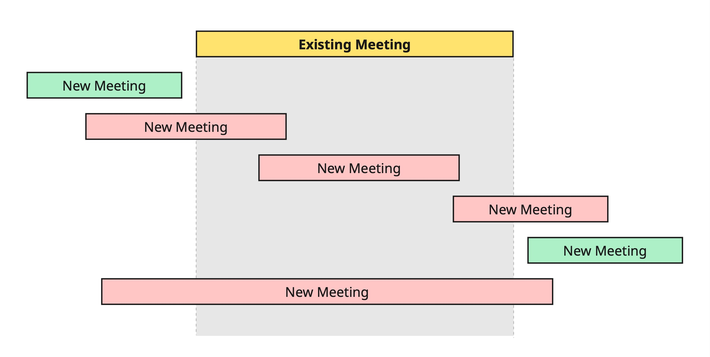
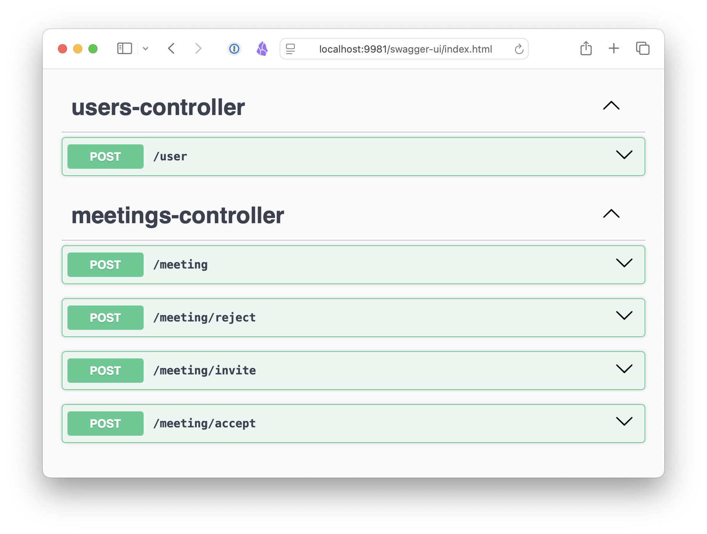

# ⚡Quick Meetings ⚡

This is a online application for creating and managing meetings.
Unlike traditional testing, which relies on manually writing individual test cases, this project
uses **property-based testing** to uncover subtle bugs.

<p align="center">

</p>

Instead of checking predefined scenarios, we rely on system properties (invariants) and let the test
framework **automatically generate** diverse input combinations to explore the problem space.

The fundamental expectation is simple: We want to disallow any meeting that overlaps with an
existing meeting -- ie, the system should not allow a person to be in two meetings at the same time.
For example, the meetings in red should not be allowed, while the green meetings are okay:

<p align="center">

</p>

## What could possibly go wrong?

This is a simple application with five endpoints. They are manually tested and works for the simple
cases.

<p align="center">

</p>

However, the following branches highlight bugs in different parts of the system that were found by
property-based tests. The readme files in the branches explain the bugs and how it was discovered by
a property-based test:

- [Does the API server always return valid JSON?](https://github.com/mourjo/quick-meetings/tree/demo-1-server-never-returns-5xx)
- [Does the API server accept dates in the correct format?](https://github.com/mourjo/quick-meetings/tree/demo-2-invalid-date-range)
- [Can a meeting be created if it overlaps with the user's other meetings?](https://github.com/mourjo/quick-meetings/tree/demo-3-meeting-creation-scenarios)
- [Does any action allow a person to be in two meetings at the same time?](https://github.com/mourjo/quick-meetings/tree/demo-4-meeting-acceptations)
- [Can we end up with meetings with no attendees?](https://github.com/mourjo/quick-meetings/tree/demo-5-empty-meetings)

## Switching Between Branches

There are some scripts for easier switching between branches / running tests:

| Script          | Branch                                                                                                               | Testing Area                                                                   |
|-----------------|----------------------------------------------------------------------------------------------------------------------|--------------------------------------------------------------------------------|
| `demo-1.sh`     | [demo-1-server-never-returns-5xx](https://github.com/mourjo/quick-meetings/tree/demo-1-server-never-returns-5xx)     | Presentation: APIs should always return JSON                                   |
| `demo-2.sh`     | [demo-2-invalid-date-range](https://github.com/mourjo/quick-meetings/tree/demo-2-invalid-date-range)                 | Presentation: Valid date ranges should be accepted                             |
| `demo-3.sh`     | [demo-3-meeting-creation-scenarios](https://github.com/mourjo/quick-meetings/tree/demo-3-meeting-creation-scenarios) | A meeting cannot be created if it overlaps with an existing meeting            |
| `demo-4.sh`     | [demo-4-meeting-acceptations](https://github.com/mourjo/quick-meetings/tree/demo-4-meeting-acceptations)             | Interleaving multi-user actions should not allow overlapping meetings to exist |
| `demo-5.sh`     | [demo-5-empty-meetings](https://github.com/mourjo/quick-meetings/tree/demo-5-empty-meetings)                         | No end-user action can cause a meeting to become empty with no attendees       |
| `demo-reset.sh` | [main](https://github.com/mourjo/quick-meetings/)                                                                    | No failing test - All fixes implemented                                        |
| `fix*.sh`       |                                                                                                                      | Scripts that fixes bugs in the individual branches                             |

## Jqwik library

This repository uses [Jqwik](https://github.com/jqwik-team/jqwik), a library that brings
property-based testing to Java.

## Running the System

Initialize the database with the schema:

```bash
docker compose up
```

Start the server:

```bash
mvn spring-boot:run 
```

Alternatively, compile it into a Jar and then run the Jar:

```bash
mvn clean package spring-boot:repackage -DskipTests 
java -jar target/quickmeetings-0.0.1-SNAPSHOT.jar
```

This should start the local server with a Swagger UI
at [localhost:9981/swagger-ui](http://localhost:9981/swagger-ui/index.html#/)

## Database Access

The database init script
is [here](https://github.com/mourjo/quick-meetings/blob/main/src/test/resources/init.sql). Connect
to the database using:

```bash
docker exec -it postgres_quick_meetings  psql -U justin -d quick_meetings_test_db
```
