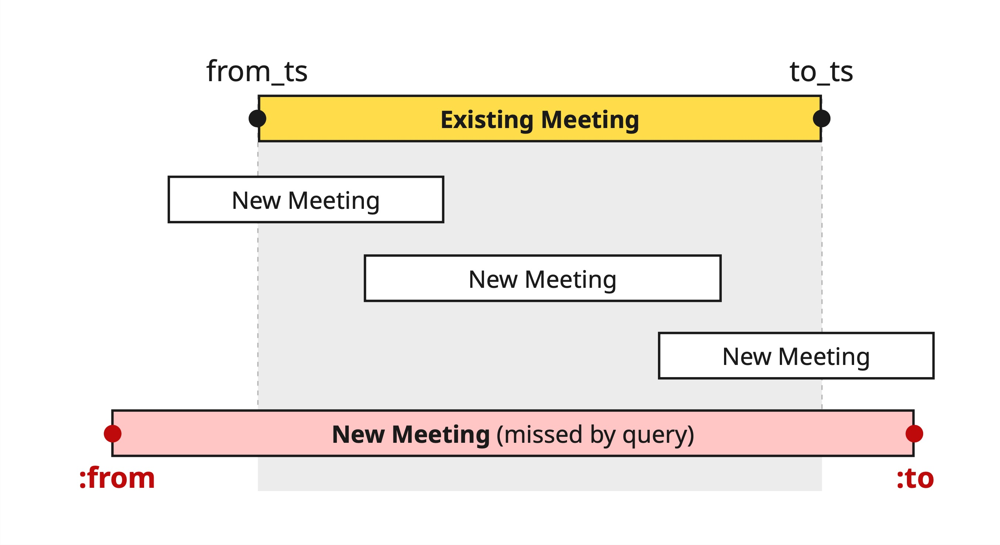

# quick-meetings

This branch identifies a SQL bug which is easy to miss while identifying overlapping meetings.

## Run the failing test

To run the problematic test:

```bash
mvn clean test -Dgroups=test-being-demoed
```

## Bug: SQL query to check overlaps is wrong

This test fails when the second meeting is overlapping with the first but only if the
second meeting **starts before** and **ends after** the first - note how the original
sample finds a larger time overlap but the shrunk example finds the smallest failing
case:

```
Shrunk Sample (130 steps)
-------------------------
  meeting1Start: 2025-01-01T10:00:01
  meeting1DurationMins: 1
  meeting2Start: 2025-01-01T10:00
  meeting2DurationMins: 2

Original Sample
---------------
  meeting1Start: 2025-01-01T20:09:29
  meeting1DurationMins: 6
  meeting2Start: 2025-01-01T19:55:33
  meeting2DurationMins: 49
```

## The query that was problematic

The following query has a bug (in the last AND clause) - it is quite hard to catch it at first
glance:

```sql
SELECT *
FROM
meetings existing_meeting JOIN user_meetings um ON existing_meeting.id = um.meeting_id
WHERE um.user_id IN (:userIds)
AND um.role_of_user IN ('OWNER', 'ACCEPTED')
AND (
  (existing_meeting.from_ts <= :from AND existing_meeting.to_ts >= :from)
  OR
  (existing_meeting.from_ts <= :to AND existing_meeting.to_ts >= :to)
)
```

The red meeting overlaps with the exsiting meeting but is missed by this query:\


### Fix

To fix this, use [a different query](https://github.com/mourjo/quick-meetings/commit/7cb6fc948a49281e73dedfdf2899b3a04d8f34a9), shown in the next section below (`./fix.sh`):

```
git revert --no-commit 7cb6fc9 && git reset HEAD
```

### Updated Query

Following is the fixed query clause (`:from` and `:to` are the starting and ending times of the new
meeting about to be created):

| Original Clause                                                                                                                                                                                                                                                                                        | Fixed Clause                                                                                       |
|--------------------------------------------------------------------------------------------------------------------------------------------------------------------------------------------------------------------------------------------------------------------------------------------------------|----------------------------------------------------------------------------------------------------|
| <pre>(<br>&nbsp;&nbsp;existing_meeting.from_ts <= :from<br>&nbsp;&nbsp;&nbsp;&nbsp;AND <br>&nbsp;&nbsp;existing_meeting.to_ts >= :from<br>) <br><br>OR<br><br>(<br>&nbsp;&nbsp;existing_meeting.from_ts <= :to <br>&nbsp;&nbsp;&nbsp;&nbsp;AND<br>&nbsp;&nbsp;existing_meeting.to_ts >= :to<br>)</pre> | <pre>existing_meeting.from_ts <= :to <br>&nbsp;&nbsp;AND <br>existing_meeting.to_ts >= :from</pre> |

Arguably, the original clause, although incorrect, is more intuitive than the correct fixed clause.
**The human tendency is to prefer an understandable solution over a more correct one.**

Unlike traditional test cases that are manually enumerated, property-based tests do not require the
programmer to handpick specific inputs. PBTs test the system's correctness by ensuring properties
(or invariants) hold true for a wide range of automatically generated inputs -- thus bypassing the
programmer's cognitive humane biases.

## Switching Between Branches

There are some scripts for easier switching between branches / running tests:

| Script            | Branch                                                                                                               | Testing Area                                                                   |
|-------------------|----------------------------------------------------------------------------------------------------------------------|--------------------------------------------------------------------------------|
| `demo-1.sh`     | [demo-1-server-never-returns-5xx](https://github.com/mourjo/quick-meetings/tree/demo-1-server-never-returns-5xx)     | Presentation: APIs should always return JSON                                   |
| `demo-2.sh`     | [demo-2-invalid-date-range](https://github.com/mourjo/quick-meetings/tree/demo-2-invalid-date-range)                 | Presentation: Valid date ranges should be accepted                             |
| `demo-3.sh`     | [demo-3-meeting-creation-scenarios](https://github.com/mourjo/quick-meetings/tree/demo-3-meeting-creation-scenarios) | A meeting cannot be created if it overlaps with an existing meeting            |
| `demo-4.sh`     | [demo-4-meeting-acceptations](https://github.com/mourjo/quick-meetings/tree/demo-4-meeting-acceptations)             | Interleaving multi-user actions should not allow overlapping meetings to exist |
| `demo-5.sh`     | [demo-5-empty-meetings](https://github.com/mourjo/quick-meetings/tree/demo-5-empty-meetings)                         | No end-user action can cause a meeting to become empty with no attendees       |
| `demo-reset.sh` | [main](https://github.com/mourjo/quick-meetings/)                                                                    | No failing test - All fixes implemented                                        |
| `fix*.sh`       |                                                                                                                      | Scripts that fixes bugs in the individual branches                             |
